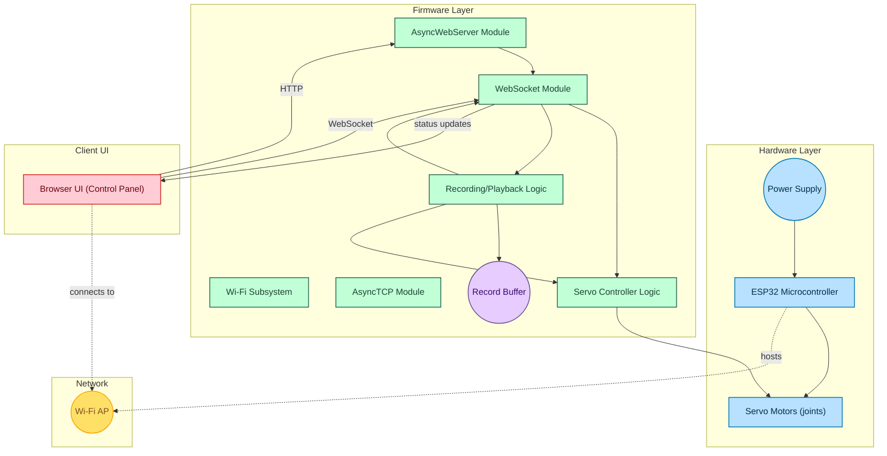
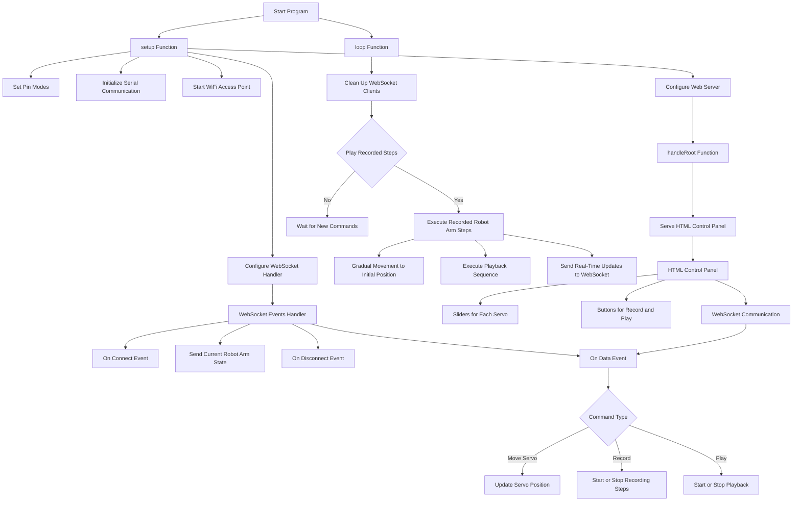

# 🎯 **Robotic Arm Project Using ESP32**  
  
  
  

---

## 🎨 **About the Project**  
This project is focused on building a **robotic arm** powered by the versatile **ESP32 microcontroller**. With capabilities for precise motion and wireless control, this project explores the intersection of **robotics** and **IoT**.

---

### 🔍 **Key Highlights**  
- 👨‍💻 A fully programmable robotic arm.  
- 📡 Wireless control via ESP32’s built-in Wi-Fi module.  
- 🌐 IoT-ready for cloud-based functionality.

---

## 🌟 **Features**  
✨ **Wireless Control**: Operate the arm from a distance using Wi-Fi.  
⚙️ **Precision Movements**: Program tasks with high accuracy.  
🛠️ **Modular Design**: Easy assembly and customization.  
📡 **IoT Integration**: Expandable for cloud-based operations.

---

## 🧭 **Workflow Diagram**

---

## 💻 **Technologies Used**  
| Component         | Purpose                      |  
|-------------------|------------------------------|  
| 🧠 **ESP32**      | Microcontroller for control. |  
| 🌀 **Servo Motors**| Precise movement of joints.  |  
| 🛠️ **Arduino IDE**| Programming environment.     |  
| 📡 **Wi-Fi**      | Wireless communication.      |  

---

## 📖 **Usage**  
1. Power on the robotic arm and establish a Wi-Fi connection.  
2. Use a **web-based app**, **smartphone**, or **controller interface** to send commands.  
3. Observe the robotic arm executing tasks smoothly.  

---

## 🛡️ **License**  
This project is licensed under the [MIT License](LICENSE).  

---

## 🙌 **Acknowledgments**  
- [Er Jyoti Ranjan Nayak](https://github.com/1997Jyotiranjannayak) Sir for guiding us in this project.  
- Open-source tools for enabling smooth development.  
- Our dedicated team for collaborative efforts.  

---

### 🖼️ **Preview**  
coming soon... 
